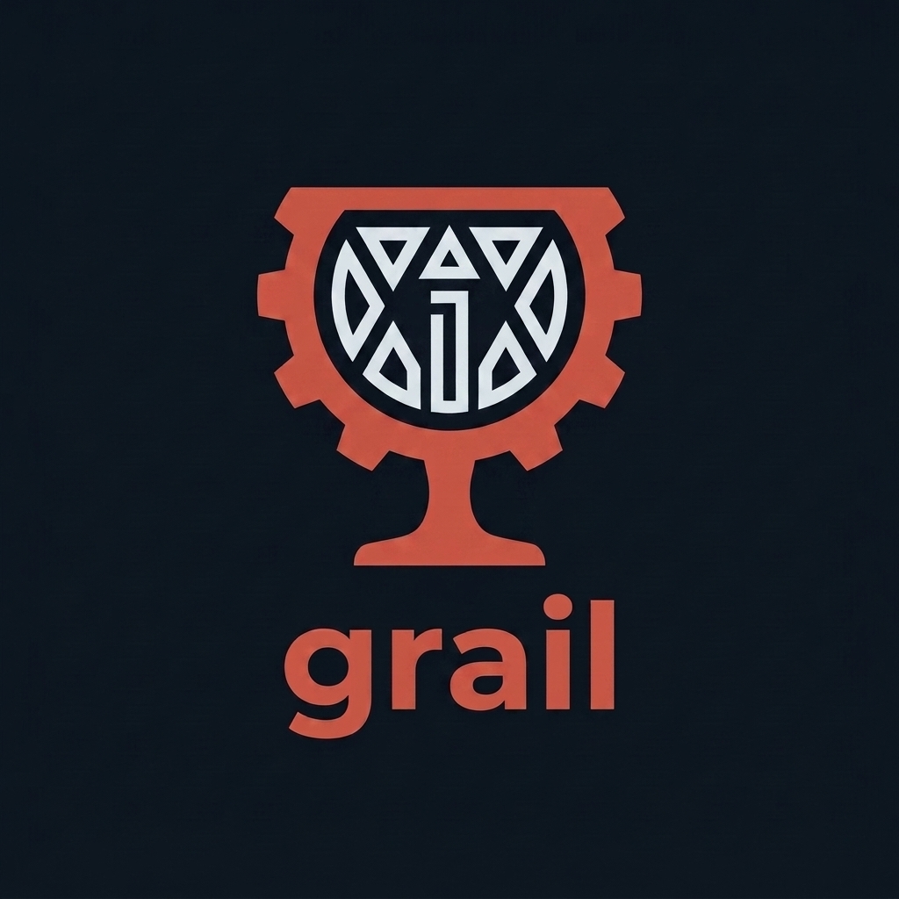
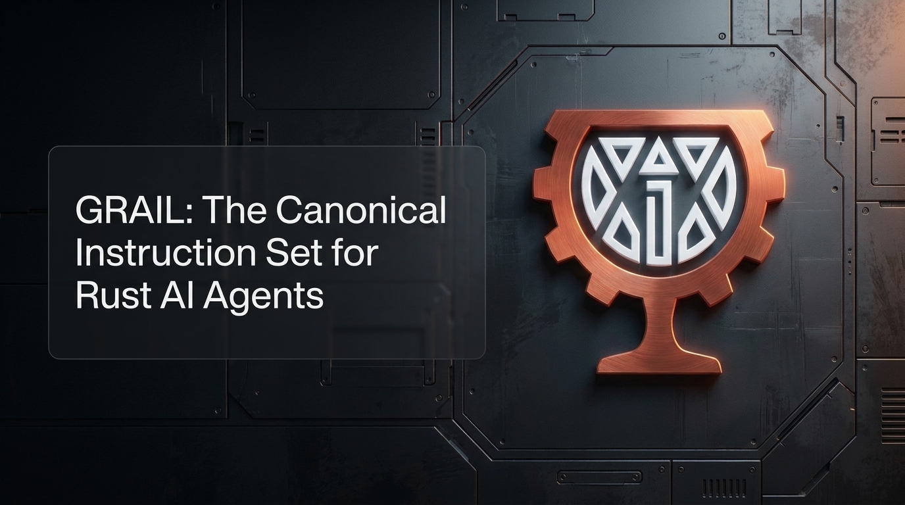

<p align="center">
  
</p>
# grail: Agent Instruction Repository

***A Systems-Engineering-disciplined workflow for building Rust software with AI agents.***

[](#architecture)
[](agents/DESIGN.md)
[](agents/DEVELOPMENT.md)
[](agents/PREFERRED_DEPENDENCIES.md)
[](agents/CI.md)
[](https://deepm1nd.github.io/grail/)

> **Note:** this README describes the `grail` instruction repository itself, following the
> same section structure `grail` mandates for the projects it generates
> (`agents/exemplars/README_template.md`) — a project built by `grail` should be as legible
> as `grail` itself.



## Table of Contents

* [About](#about)
* [Key Features](#key-features)
* [Quick Start](#quick-start)
  * [Repository Layout](#repository-layout)
  * [Adopting grail in a Project](#adopting-grail-in-a-project)
* [Standards Enforced](#standards-enforced)
* [Architecture](#architecture)
* [Metrics & Badges (Generated Projects)](#metrics--badges-generated-projects)
* [Development Workflow](#development-workflow)
* [Contributing](#contributing)
* [Security](#security)
* [License](#license)

## About

`grail` is the canonical instruction set governing AI agents building Rust software. It
exists because two separate failure modes are common when an LLM agent "just starts
coding": requirements drift silently as work proceeds, and nobody independently checks
whether the built thing actually satisfies what was asked. `grail` addresses both by
importing a discipline software engineering borrowed from **Systems Engineering (SE)**
decades ago and rarely applies with real rigor to agent-driven development: requirements
are decomposed and made verifiable *before* design begins, design is independently audited
*before* a plan is written, and the plan is independently audited *before* any code is
touched. Nothing proceeds past a gate on the say-so of the agent that produced it.

A project adopts `grail` by placing a redirect file (`AGENTS.md`, from
`AGENTS_md.template`) that points agents here — `grail` itself never needs to be copied
into a project, and updates to `grail` apply the next time an agent reads it.

## Key Features

* **Gated, two-phase lifecycle:** a 9-step **Design Phase** (Claude) produces an
  Architecture Specification, Development Plan, and Development Checklist; a **Development
  Phase** (Jules) executes the Plan, one phase at a time, against that specification —
  never the reverse.
* **Independent audits, not self-certification.** Both the Architecture Specification
  (Step 7) and the Development Plan/Checklist (Step 9) are checked by a dedicated audit
  pass that only finds defects — it never fixes them in the same breath it finds them.
* **Traceability by construction.** Every requirement traces to a test identifier at Step
  4; every development task cites the exact specification item it derives from (Design
  Refs) at Step 8 — the same mechanism SE calls a Requirements Traceability Matrix, applied
  automatically rather than reconstructed after the fact.
* **Formalized CI as a continuous, independent check** (`agents/CI.md`) — build, test,
  coverage, license, and security-advisory verification on every push, functioning as an
  ongoing configuration audit against the approved baseline, not a one-time gate.
* **Preferred-parts-list dependency governance** — Rust dependencies, dev tools, and infra
  services are each governed by their own approved/forbidden/requires-approval list
  (`agents/PREFERRED_DEPENDENCIES.md`, `agents/PREFERRED_TOOLS.md`,
  `agents/PREFERRED_SERVICES.md`), the SE equivalent of a Qualified Parts List.

## Quick Start

### Repository Layout

```
grail/
├── AGENTS.md                        # Primary agent instruction file (read first)
├── CLAUDE.md                        # Design Phase working arrangement (Claude-specific)
├── AGENTS_md.template               # Redirect template
├── CHANGELOG.md                     # Full version history (human reference only)
├── README.md                        # This file
├── assets/
│   └── images/                      # README/docs visual assets (logo, hero, diagrams)
│       ├── logo_primary.png
│       └── hero_desktop.png
└── agents/
    ├── DESIGN.md                    # Design & Planning Phase guide
    ├── DEVELOPMENT.md               # Development Phase guide
    ├── CI.md                        # GitHub Actions CI stage skeleton
    ├── PREFERRED_DEPENDENCIES.md     # Mandated/forbidden Rust library dependencies
    ├── PREFERRED_TOOLS.md            # Approved development tools
    ├── PREFERRED_SERVICES.md         # Approved infrastructure services
    ├── RUST_PREFERENCES.md           # Rust-specific design constraints
    ├── ESP32_ESPIDF_RUST_BUILD_GUIDE.md  # ESP32/ESP-IDF only — conditionally referenced
    └── exemplars/
        ├── architecture_specification_template.md
        ├── development_plan_template.md
        ├── development_checklist_template.md
        ├── README_template.md       # Generated project README skeleton
        └── dev_prompt_template.md
```

**Note:** a *generated project* (one that follows this workflow) has its own, different
structure — `src/`/`crates/`, `assets/`, `deploy/`, `metrics/`, `scripts/`, `test/`,
`.github/workflows/` — per `agents/exemplars/development_plan_template.md` §3 and
`agents/exemplars/README_template.md`. This repository's own `assets/images/` above is
README/docs-only — it is not the same `assets/{html,images,audio,video}/` convention that
governs a generated project's tracked UI assets.

**Visual assets, beyond the logo/hero already planned:**

- **`architecture_pipeline.png`/`.svg`** — the biggest lever: a horizontal diagram of the 9
  Design Steps as a gated pipeline, each step's box labeled with its SE analogue from the
  [Architecture](#architecture) table (ConOps → ... → CDR-equivalent), with the Step 7/9
  audit gates visually distinct (e.g., a diamond or red-outlined box) from the sequential
  steps — this table is the README's most information-dense section and the one most
  likely to actually be read if it's a diagram instead of a wall of table rows.
- **`two_phase_lifecycle.png`** — a simple two-lane diagram: Design Phase (Claude) → handoff
  package → Development Phase (Jules), with the Escalation Trigger loop drawn explicitly as
  an arrow back from Development to Design — this is the single hardest-to-grasp-from-prose
  mechanic in the whole system (people default to assuming a linear handoff).
- **`ci_stage_flow.png`** — small horizontal strip of `agents/CI.md`'s Stage 0–8 pipeline,
  with the conditional stages (WASM/E2E/infra) visually greyed-out/dashed to show they're
  per-project, not universal.
- **`favicon.ico`/`social_preview.png`** — a small square/wide-format crop of the logo, for
  the GitHub repo's own social preview image and any docs site favicon — cheap to produce
  once the primary logo exists, and it's what shows up when this repo is linked/shared
  externally.
- **`hero_mobile.png`** — if `hero_desktop.png` is wide-format, a cropped/stacked mobile
  variant avoids it rendering illegibly small on GitHub's mobile web view.

### Adopting grail in a Project

1. **Start a Design Phase session with Claude**, in the target project's repo, having it
   read `AGENTS.md` (which redirects here) and `CLAUDE.md`. Work through
   `agents/DESIGN.md`'s 9 steps **one step per session** (see [Architecture](#architecture)
   below for what each step actually does and why it's ordered this way).
2. **Approve each step explicitly before the next begins.** Every step ends with a STOP and
   a summary; you reply with the exact token `APPROVED` (no "Continue"/"Proceed"
   substitutes) to advance. This is a deliberate gate, not a formality — each step's output
   becomes load-bearing for everything after it.
3. **Step 8's output is the handoff package:** the Development Plan (with a Branch Name and
   Session Unit declared per phase), the Development Checklist, the reusable Dev Prompt
   (`[projectname]_dev_prompt.md`), draft `README.md`, `.gitignore`, `ci.yml`,
   `scripts/metrics/`, `LICENSE.md`, and draft `THIRD_PARTY_LICENSES.md`. Step 9
   independently audits this package before you move on — any finding sends you back to
   Step 8, never patched in place at Step 9.
4. **Hand the project to Jules for the Development Phase.** Give Jules the Dev Prompt at the
   start of every session — it's reused verbatim, not regenerated. Each session checks out
   the current phase's branch, works exactly one Session Unit (a full Phase by default, or a
   single Task/Code+Verify sub-task if the Plan declared a finer unit), submits at every
   task's declared Submit Point, and stops — you say "Continue" to start the next session.
5. **Review evidence as it accumulates**, not just at the end: each phase's
   `test/[projectname]_phase_[N]_verification.md` (build/test summary lines, screenshots,
   clips) and `[projectname]_phaseN_summary.md` (the narrative — what happened, deviations,
   issues). A session that hits something it can't resolve stops immediately and writes its
   Phase Summary instead of guessing — bring that back to a **Design Phase session with
   Claude** to diagnose and restructure the Plan/Checklist, then hand a fresh Dev Prompt back
   to Jules to resume.
6. **Repeat step 4–5 until every phase's Exit Criteria is checked.** Development then stops
   and awaits your instruction — including, if you want it, the optional post-development
   remediation cycle (`agents/DEVELOPMENT.md` §5.4), triggered only when you explicitly ask
   for an audit.

## Standards Enforced

| Category | Governed by |
|---|---|
| Rust edition/MSRV | `agents/RUST_PREFERENCES.md`, set per project at Design Step 5 |
| Approved dependencies | `agents/PREFERRED_DEPENDENCIES.md` — Preferred/Forbidden/Requires-Approval, plus a license-compatibility criterion |
| Approved dev tools | `agents/PREFERRED_TOOLS.md` — cargo-nextest, cargo-llvm-cov, cargo-deny, cargo-audit, Trunk, etc. |
| Approved infra services | `agents/PREFERRED_SERVICES.md` — Postgres, Neo4j, Qdrant, Redis, MinIO, Mosquitto |
| CI pipeline | `agents/CI.md` — fixed stage skeleton, GitHub Actions |
| Embedded (ESP32/ESP-IDF) | `agents/ESP32_ESPIDF_RUST_BUILD_GUIDE.md` |

## Architecture

`grail`'s Design Phase is, deliberately, a Systems Engineering process wearing software
clothing. Each of its 9 steps maps to a recognizable SE discipline — the mapping isn't
decorative; it's why the step exists in that position and not another:

| Step | What it does | Systems Engineering analogue |
|---|---|---|
| **1. Concept Intake & Context Mapping** | Establishes what the system is for, before any solution shape is proposed. | Concept of Operations (ConOps) / stakeholder needs definition — SE's insistence that the problem is characterized before the solution is. |
| **2. User Story Elicitation** | Draws out operational scenarios exhaustively, always in full — no size-based skipping. | Operational Requirements / Use Case elicitation — the source data every downstream requirement must trace back to. |
| **3. Recursive Requirement Decomposition** | Breaks stories into atomic, individually-satisfiable requirements. | Classical top-down functional decomposition — the same technique that turns a mission objective into subsystem requirements in any SE domain. |
| **4. Iterative Questioning & Test Identification** | Assigns a Test Case ID to every requirement *as it's written*, not after. | A core SE tenet often skipped in software: a requirement you cannot verify is not a requirement, it's a hope. Verification criteria are defined concurrently with the requirement, not bolted on later. |
| **5. Decomposition Gate & Verification Feasibility** | Checks every requirement against real tool/dependency/license feasibility before proceeding; sets MSRV; identifies CI stage applicability. | A System Requirements Review (SRR) gate — nothing advances to design until the requirement set is confirmed buildable and verifiable in the actual target environment. |
| **6. Architecture Synthesis** | Produces the Architecture Specification against **ISO/IEC/IEEE 42010** viewpoints. | This step *is* SE by explicit standard — 42010 is the systems-and-software architecture description standard SE practitioners already use; `grail` doesn't analogize to it, it conforms to it. |
| **7. Spec Audit** | An independent pass that only finds defects in the Architecture Specification — never fixes them in the same session. | Independent Verification & Validation (IV&V) / a Preliminary Design Review's independent review board — the auditor is structurally prevented from grading its own homework. |
| **8. Development Plan & Checklist Generation** | Produces a Work Breakdown Structure (phases/tasks) with mandatory per-task traceability (Design Refs) back to the audited Spec. | A Work Breakdown Structure (WBS) paired with a Requirements Traceability/Verification Cross-Reference Matrix — every unit of work is anchored to a specific, already-approved requirement, never a rediscovery of scope mid-build. |
| **9. Plan & Checklist Audit** | A second, independent audit — this time of the Plan/Checklist against the Spec and against the Plan's own Definition of Done. | A Critical Design Review (CDR) gate — the last independent check before implementation resources are committed, structurally distinct from Step 7's earlier, different-object review. |

**Why two independent audits instead of one.** SE practice distinguishes *validation*
(did we build the right thing — checked against the Spec's own fidelity to the original
concept, Step 7) from *verification* (did we plan to build the thing right — checked
against whether the Plan actually implements the audited Spec and satisfies its own
Definition of Done, Step 9). Collapsing these into a single audit is a common shortcut that
lets a plan-level defect hide behind an approved specification, or vice versa; `grail`
keeps them as two separate, independently-gated passes for exactly this reason.

**Configuration management, continuously, not just at handoff.** Once the Development
Phase begins, SE's "does the built thing still match the approved baseline" discipline
continues as an ongoing process rather than a one-time gate:

- **Formalized CI** (`agents/CI.md`) re-runs build, test, coverage, and — critically —
  license/security-advisory checks on every push, functioning as a continuous configuration
  audit rather than a single pre-delivery inspection.
- **Preferred/Forbidden/Requires-Approval tiers** for dependencies, tools, and services
  (`agents/PREFERRED_*.md`) are the direct analogue of a Qualified Parts List — an unlisted
  "part" (dependency) requires the same explicit approval a Requires-Approval part would in
  any other engineering discipline, not a unilateral substitution.
- **Escalation Triggers and Change Control** (`agents/exemplars/development_plan_template.md`
  §13–14) mean a Development Phase session that hits something outside its Plan does not
  improvise a fix — it stops, exactly as an SE technician would stop and request an
  Engineering Change Request rather than deviate from an approved work instruction in the
  field.
- **Additive-only operations** (no deletion/overwrite of prior work without explicit
  approval) mirror configuration management's insistence that a baseline changes only
  through a controlled, recorded process — never silently.

This is the throughline across every mandate in this repository: requirements are made
verifiable before they're built, designs are independently checked before they're planned,
plans are independently checked before they're executed, and the built artifact is
continuously re-verified against its approved baseline for the life of the project — the
same discipline Systems Engineering has applied to hardware and large-scale systems for
decades, applied here to Rust software built by AI agents.

## Metrics & Badges (Generated Projects)

`grail` itself carries no build/coverage metrics — it is instructions, not compiled code.
A **project generated by `grail`**, however, gets live shields.io badges reading from a
`metrics/` directory that CI maintains automatically (`agents/CI.md` Stage 8) — coverage,
test pass count, security audit status, and license-check status, each fed by the
project's own `cargo-nextest`/`cargo-llvm-cov`/`cargo-deny`/`cargo-audit` runs. See
`agents/exemplars/README_template.md` for the exact badge/table structure every generated
project inherits.

## Development Workflow

`grail` runs on a strict two-phase, two-agent lifecycle:

1. **Design Phase (`agents/DESIGN.md`, Claude):** Concept → Architecture Specification,
   Development Plan, Development Checklist, through the 9-step gated workflow described in
   [Architecture](#architecture) above.
2. **Development Phase (`agents/DEVELOPMENT.md`, Jules):** Executes the Development Plan
   phase by phase — one Session Unit per agent session, on that phase's own branch —
   following a build→test→evidence loop per task, with CI (`agents/CI.md`) as an async,
   human-reviewed backstop rather than a session-blocking gate.

### Key Mandates

- **Rust as the standard.** 2024 edition required; workspace MSRV set per project at
  Design Step 5.
- **Gated execution.** Every design step ends with a STOP and exact `APPROVED` before the
  next step begins — no "Continue"/"Proceed" substitutes. Each step runs in its own session.
- **One fixed procedure, every step but 7 and 9: RCD → bulk-accept → RATS.** Core content is
  drafted in one research-backed batch (Research, Competitive research, Draft), bulk-accepted,
  and every residual assumption/flagged item runs through Research-Analysis-Table-
  Selectable-options, resolving to exactly one of Resolved / Deferred-to-a-step / Future
  Feature / Rejected. No autonomy toggle, no Tailored Mode — Step 2 (User Stories) always
  runs in full regardless of project size.
- **Independent audits.** Step 7 and Step 9 are pure finders, never fixers — no RCD/RATS.
  Every finding is tagged Trivial or Substantive; an all-Trivial result is fixed in place,
  same session, no backtrack. Any Substantive finding requires reopening the originating
  step (full multi-session workflow, or a user-invoked **Post-Audit Fix Pass** — a
  compressed single-session equivalent that fixes every finding plus anything discovered
  incidentally, never leaving a defect flagged-but-unfixed, and still mandatorily ends in a
  fresh audit session).
- **Additive-only operations.** No deletion/overwrite without explicit approval.
- **Maximal implementation.** No stubs or partial implementations.
- **No cross-session memory.** Every session starts from what's actually on disk/provided.
- **One Session Unit per development session** — a full Phase by default, or a finer
  Task/Code+Verify unit where the Plan declares one; never more than one per session.
- **Per-phase branch, per-task submit.** Each phase gets its own human-readable Branch Name
  (assigned at Design Step 8); every task submits immediately on DoD completion — never
  batched to end-of-phase — bounding crash blast-radius to the task in flight.
- **Development agent escalation: stop, don't troubleshoot further.** A missing tool that
  installs cleanly is the sole case that continues automatically. Everything else the agent
  can't resolve itself — conflicts, failures, ambiguity — stops the entire session
  immediately: write the Phase Summary, no PR, no further progress. The human brings it to
  a Design Phase session to diagnose and restructure the Plan/Checklist.
- **Tracked UI/media assets.** User-supplied HTML/image/audio/video assets tracked by
  filename via an Asset Manifest, landing at fixed `assets/{html,images,audio,video}/`
  paths — never packaged into a Design-Phase handoff note, only referenced by filename.
- **Per-phase Verification file.** `test/[projectname]_phase_[N]_verification.md` — concise
  build/test summary lines and pointers to `test/phase_[N]/` screenshots/clips — evidence,
  not narrative; the Phase Summary links to it rather than repeating it.
- **Development agents write to one file, bracket-content-only.** The Development Checklist,
  and only within the agent's current phase: flipping a mark in an existing `[ ]`, checking
  a `Submitted` box, or appending a Session Log row — never rewording, restructuring, or
  touching another phase's marks. Every other doc file is read-only to it.
- **Project README drafted at Design Step 8**, reviewed/confirmed/enhanced during
  Development Phase's Phase 0, not scaffolded from scratch there.
- **CI as an async, human-reviewed backstop.** `ci.yml` and `THIRD_PARTY_LICENSES.md` are
  drafted at Design Step 8 (same pattern as README/`.gitignore`) and reviewed at
  Development Phase 0. CI itself (`agents/CI.md`) never blocks a session — no session
  waits on a push's CI result, and no Development Plan rule requires it. A red check is
  reviewed the same way other between-session evidence is: by the human, as it accumulates.
- **Preferred tooling.** Dependencies/tools/services drawn from
  `agents/PREFERRED_DEPENDENCIES.md`, `agents/PREFERRED_TOOLS.md`,
  `agents/PREFERRED_SERVICES.md`. Unlisted items require explicit approval.
- **ESP32/ESP-IDF projects** additionally consult `agents/ESP32_ESPIDF_RUST_BUILD_GUIDE.md`.

## Contributing

Changes to `grail` itself affect every project pointing at it — propose changes with the
same rigor `grail` demands of a project's own Architecture Specification: state the
problem, the change, and its downstream effect on any file that cross-references it.
`CHANGELOG.md` records the full version history; see it before assuming a section's
current wording is unmotivated.

## Security

If you discover an issue with `grail`'s own instructions that has security implications for
projects built under it (e.g., a gap in the dependency/license governance model), please
raise it directly with the maintainer rather than in a public issue.

## License

*(Not yet formally specified for `grail` itself — the PolyForm Noncommercial default
described in `agents/exemplars/README_template.md` governs **projects generated by**
`grail`, not necessarily this instruction repository. Flag this explicitly rather than
assume one applies here until stated.)*
